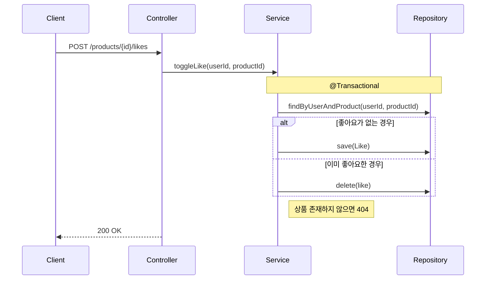

# Requirements Analysis: 요구사항 분석 + 시나리오 기반 설계

요구사항을 받아서 코드 작성 전까지의 모든 설계 과정을 개발자와 함께 진행한다.
혼자 정리해서 던지는 게 아니라, 같이 얘기하면서 시나리오를 만들고 다이어그램으로 검증하는 흐름.

---

## 전체 흐름

```
① 입력 파싱
② 유저 여정 스케치
③ 도메인 식별 + 라운드 순서
④ 도메인별 라운드 (반복)
   ├─ 4a. 문제 재해석 (3관점)
   ├─ 4b. Q&A + 시나리오 동시 도출
   ├─ 4c. 다이어그램 작성 (시퀀스 + 클래스)
   └─ 4d. 시나리오로 다이어그램 검증
⑤ 전체 통합 (ERD + 도메인 간 관계)
⑥ 프리뷰 (HTML + live-server)
⑦ 파일 저장
```

---

## ① 입력 파싱

사용자가 아래 형식으로 호출한다:

```
/requirements-analysis 를 통해 아래 요구사항을 분석합니다.
목표: xx
요구사항:
  - a
  - b
제안사항:
  - c
  - d
```

**스킬이 하는 일:**
- 목표 / 요구사항 / 제안사항을 구분해서 정리
- 빠진 항목이 있으면 물어본다 ("목표가 안 보이는데, 이거야?")
- 자유 형식으로 들어오면 위 구조로 재정리해서 확인받는다
- 별도 파일(@파일경로)이 제공되면 Read로 읽어서 파싱한다

---

## ② 유저 여정 스케치

다이어그램 전에, 전체 서비스 흐름을 자연어 시나리오로 한 번 훑는다.

**목적:** 설계 범위를 확정하고, 전체 그림을 공유한다.

**진행 방식:**
- 요구사항에서 유저의 행동 흐름을 자연어로 정리
- 같이 보면서 물어본다:
  - "이 흐름에서 우리가 다루는 범위가 어디부터 어디까지야?"
  - "빠진 액터나 외부 시스템이 있어?"
  - "이 순서가 실제 유저 행동이랑 맞아?"
- 범위 밖의 것은 명시적으로 "제외"로 표기

**예시 출력:**
> 회원가입한 유저가 → 브랜드별 상품을 둘러보고 → 마음에 드는 상품에 좋아요를 누르고 → 여러 상품을 골라 → 한 번에 주문하고 결제한다
>
> **범위 내:** 상품/브랜드 조회, 좋아요, 주문
> **범위 밖:** 회원가입, 결제(추후 개발)

---

## ③ 도메인 식별 + 라운드 순서

유저 여정에서 도메인을 뽑아내고, **의존성 순서**로 라운드를 정한다.

```
라운드 1: 브랜드 + 상품 (기반 데이터 — 다른 도메인이 참조)
라운드 2: 좋아요 (유저 행동 — 상품에 의존)
라운드 3: 주문 (핵심 비즈니스 — 상품 + 재고에 의존)
```

**순서 기준:** 의존성. 상품이 있어야 좋아요가 되고, 상품이 있어야 주문이 된다.
이 순서를 사용자와 합의한 뒤 라운드를 시작한다.

---

## ④ 도메인별 라운드 (핵심 — 반복)

도메인 하나를 잡고 4스텝을 돈다. 이 라운드가 스킬의 핵심이다.

### 4a. 문제 재해석

요구사항을 그대로 믿지 않는다. 3가지 관점에서 다시 본다:

| 관점 | 질문 예시 |
|------|-----------|
| **사용자** | "좋아요를 두 번 누르면 어떻게 돼야 해?" |
| **비즈니스** | "좋아요 수가 상품 정렬에 영향을 줘?" |
| **시스템** | "동시에 100명이 좋아요 누르면?" |

재해석 결과를 짧게 정리해서 보여준다:
> "좋아요 등록/취소" → "좋아요 상태의 일관성을 보장하면서, 유저 행동 데이터를 축적하려는 문제"

### 4b. Q&A + 시나리오 동시 도출 (티키타카 구간)

**진행 규칙:**
- **한 번에 질문 하나.** 한꺼번에 쏟아붓지 않는다.
- **질문할 때 시나리오를 같이 던진다.** 추상적으로 묻지 않고 구체적 상황을 준다.
- **선택지가 있으면 옵션 + 영향도를 함께 제시한다.**
- AskUserQuestion 도구를 적극 활용해서 선택지를 구조화한다.

**반드시 포함할 질문 유형:**

| 유형 | 예시 |
|------|------|
| **정책** | "좋아요 취소 후 재등록에 쿨타임이 필요해?" |
| **경계** | "좋아요 수 집계는 좋아요 도메인 책임이야, 상품 도메인 책임이야?" |
| **확장** | "나중에 좋아요 외에 북마크나 찜 같은 기능이 추가될 수 있어?" |
| **예외** | "삭제된 상품에 대한 기존 좋아요는 어떻게 돼?" |

**시나리오 동시 도출 예시:**
> "유저A가 상품 상세에서 좋아요를 누름 → 5초 뒤에 실수로 다시 누름 → 이때 토글이야, 아니면 중복 에러야?"
>
> - **선택지 A:** 토글 (누를 때마다 등록/취소 전환) → 구현 단순, UX 직관적
> - **선택지 B:** 멱등 등록 + 별도 취소 API → RESTful, 의도 명시적

합의된 내용은 바로 정리해둔다.

### 4c. 다이어그램 작성

합의된 내용으로 시퀀스 다이어그램 + 클래스 다이어그램을 Mermaid로 작성한다.

**다이어그램 전에 반드시:**
- 왜 이 다이어그램을 그리는지 한 줄로 설명
- 이 다이어그램으로 무엇을 검증하려는지 명시

**다이어그램 후에 반드시:**
- "여기서 봐야 할 포인트" 2-3줄로 해석

#### 다이어그램 대원칙

- **정보량이 없는 흐름은 안 그린다.** 정말 단순한 save/findById (Controller → Service → Repository 한 줄짜리)는 그리지 않는다. 다만 같은 save라도 동시성·이벤트·캐시 무효화·권한 체크 같은 협력이 끼면 그릴 가치가 있다. "이거 왜 이렇게 되지?" 하고 동료가 물어볼 만한 부분이 기준이다.
- **동료가 물어볼 것을 미리 표기한다.** 트랜잭션 경계, 핵심 판단 분기, 에러 발생 지점 — 리뷰어가 "여기서 트랜잭션은?" 하고 물을 곳에 Note를 먼저 달아둔다.
- **불필요하게 많이 그리지 않는다.** 도메인별로 보통 1-2개로 충분하다. 비슷한 흐름을 여러 번 그릴 필요는 없다 — 그릴 가치 기준은 위 항목(정보량이 있는가)을 따른다. 복잡한 흐름, 여러 도메인이 얽히는 흐름, 상태 전이가 있는 흐름에 집중한다.
- **예외 처리는 핵심인 것만 다이어그램에 넣는다.** 모든 예외를 다 그리면 읽히지 않는다. "이 예외가 비즈니스 흐름을 바꾸는가?"를 기준으로 판단 — 바꾸면 alt/opt로 표현, 아니면 Note 한 줄로 충분.

#### 시퀀스 다이어그램 작성 규칙

시퀀스 다이어그램은 **책임 분리**와 **흐름 가독성**이 핵심이다.

**책임이 보이게:**
- participant 이름은 역할 기준으로 나눈다 (Controller / Service / Repository 등)
- 한 participant에 호출이 몰리면 책임 분리가 안 된 신호 — 짚어준다
- 도메인 로직은 Service 또는 Domain 객체에, 영속화는 Repository에 — 경계가 다이어그램에서 보여야 한다

**흐름이 읽히게:**
- 주 흐름(Happy Path)을 먼저 그린다
- 분기(alt/opt)는 주 흐름 아래에 배치
- participant 순서는 호출 방향과 일치시킨다 (왼쪽 → 오른쪽으로 흐르게)
- 분기가 많아져 다이어그램이 읽히지 않으면 쪼갠다 — 기준은 "여기서 무엇이 일어나는지 한 번에 따라갈 수 있는가". 분기 2개여도 각각이 복잡하면 쪼개고, 4개여도 작으면 한 다이어그램에 유지

**동료가 물어볼 것을 미리 표기:**
- `Note`로 트랜잭션 경계 (시작/종료) 를 명시한다
- 핵심 판단 포인트에 `Note`를 단다 ("여기서 재고 부족이면?")
- 외부 시스템 호출이 있으면 실패 시 어떻게 되는지 표기한다

**예시:**

> **봐야 할 포인트:**
> Service가 exists 판단 + 저장/삭제를 모두 책임지고 있다. 트랜잭션 경계 안에서 조회→판단→변경이 원자적으로 일어난다. 동시 요청 시 race condition 가능성은 ⑤에서 다시 짚는다.

#### 클래스 다이어그램 작성 규칙

- 도메인 모델 중심 — 구현 디테일(`@Column`, `@JoinColumn` 등 매핑 어노테이션)이 아니라 비즈니스 의미가 드러나는 형태로 표현. JPA 엔티티와 도메인 모델이 일치하는 경우엔 비즈니스 관점에서 본 모습을 그린다
- 필드는 핵심만, getter/setter 같은 보일러플레이트는 생략
- 의존 방향 화살표가 설계 의도를 드러내야 한다
- 연관 관계: 단방향 기본, 양방향은 반드시 이유가 있을 때만

### 4d. 시나리오로 다이어그램 검증

다이어그램을 그린 후, 앞에서 도출한 시나리오를 다시 걸어본다.
**시나리오는 최대한 다양한 상황으로 확장해서 생각한다.**

**진행 방식:**
- "자, 아까 그 시나리오 — 유저가 좋아요를 누르고 5초 뒤에 다시 누르는 거 — 이 시퀀스로 따라가보자"
- 다이어그램 위에서 시나리오의 각 스텝이 어디에 해당하는지 확인
- 빠진 호출, 잘못된 분기, 누락된 예외 처리를 찾는다
- 빠진 게 있으면 4b로 돌아간다

**잊기 쉬운 핵심 로직을 끌어낸다:**
- 재고 차감, 동시성, 상태 전이 같은 건 요구사항에 한 줄로 적혀있지만 구현은 복잡하다
- "이거 요구사항에 짧게 써있는데, 시나리오로 풀어보면 생각보다 고려할 게 많아"라고 먼저 짚어준다
- 예: "주문 시 재고 차감" → "두 명이 동시에 마지막 1개를 주문하면?", "차감 후 결제 실패하면 재고 복구는?"

**시나리오 확장 방향:**
- Happy Path: 정상 흐름
- 동시성: 같은 자원에 여러 요청이 동시에 올 때
- 실패/롤백: 중간 단계에서 실패하면 앞 단계는 어떻게?
- 경계값: 재고 0, 좋아요 수 최대, 주문 항목 0개
- 순서 역전: 상품이 삭제된 뒤에 좋아요/주문 요청이 오면?

**검증 질문 예시:**
- "이 시나리오에서 Repository 호출이 빠진 거 아니야?"
- "이 alt 분기에서 에러 케이스는 어디서 잡아?"
- "여기서 트랜잭션 경계가 너무 넓지 않아?"
- "재고 차감이 주문 흐름 어디에서 일어나야 해? 결제 전? 후?"

---

## ⑤ 전체 통합

모든 라운드가 끝나면 전체를 한데 모은다.

**통합 작업:**
- 각 도메인의 클래스 다이어그램을 하나로 합친다
- **ERD는 이 단계에서 그린다** — 테이블 간 관계는 전체를 봐야 하니까
- 도메인 간 의존/경계를 정리: "주문이 상품을 참조하는 방향은 이게 맞아?"

**ERD 작성 규칙:**
- 1:N → 외래키, N:M → 조인 테이블
- 삭제 정책이 필요한 엔티티에 한해 soft/hard delete 전략 명시 (soft delete면 `deleted_at` vs `is_deleted` 중 선택) — 모든 테이블이 soft delete여야 하는 건 아니다
- 상태 관리가 필요한 엔티티는 status 컬럼 포함
- 인덱스 후보를 주석으로 표기

**잠재 리스크 반드시 언급:**
- 트랜잭션 범위가 너무 넓지 않은지
- 도메인 간 결합도가 높아지는 지점
- 정책이 바뀌면 영향받는 범위
- 해결책은 정답이 아니라 선택지로: "지금 잡을 수도 있고, 나중에 리팩토링해도 되는데 — 어떻게 할래?"

---

## ⑥ 프리뷰

Mermaid 다이어그램을 브라우저에서 같이 보면서 수정한다.

**진행 방식:**
1. Mermaid JS가 포함된 HTML 파일을 생성한다
2. `npx live-server <파일경로>` 로 로컬에 띄운다
3. 다이어그램 수정할 때마다 HTML 파일 업데이트 → 브라우저 자동 리로드
4. 같이 보면서 바로 수정: "이 화살표 방향 반대 아니야?", "이 필드 빠졌는데"

**HTML 템플릿:**
```html
<!DOCTYPE html>
<html>
<head>
  <meta charset="utf-8">
  <title>Requirements Analysis - Diagrams</title>
  <style>
    body { font-family: -apple-system, sans-serif; max-width: 1200px; margin: 0 auto; padding: 2rem; background: #fafafa; }
    h2 { border-bottom: 2px solid #333; padding-bottom: 0.5rem; margin-top: 3rem; }
    .mermaid { background: #fff; padding: 2rem; border-radius: 8px; box-shadow: 0 1px 3px rgba(0,0,0,0.1); margin: 1rem 0; }
    .note { background: #fff3cd; padding: 1rem; border-radius: 4px; border-left: 4px solid #ffc107; margin: 1rem 0; }
  </style>
</head>
<body>
  <h1>Requirements Analysis</h1>
  <!-- 각 다이어그램 섹션이 여기에 추가됨 -->
  <script type="module">
    import mermaid from 'https://cdn.jsdelivr.net/npm/mermaid@11/dist/mermaid.esm.min.mjs';
    mermaid.initialize({ startOnLoad: true, theme: 'default' });
  </script>
</body>
</html>
```

프리뷰 HTML은 임시 파일이다. 최종 산출물은 ⑦의 md 파일.

---

## ⑦ 파일 저장

최종 합의된 내용을 파일로 저장한다.

**기본 저장 경로:** `docs/design/` (사용자에게 확인받는다)

```
docs/design/
├── 01-requirements.md       # 요구사항 명세 + 유저 시나리오 + Q&A 합의 내용
├── 02-sequence-diagrams.md  # 시퀀스 다이어그램 (도메인별) + 해석
├── 03-class-diagram.md      # 통합 클래스 다이어그램 + 설계 의도
└── 04-erd.md                # 통합 ERD + 테이블 설명 + 리스크
```

**각 파일에 포함할 내용:**

| 파일 | 필수 포함 |
|------|-----------|
| 01-requirements | 유저 시나리오, 도메인별 기능 정의, Q&A 합의 사항, 제외 범위 |
| 02-sequence | 도메인별 시퀀스 (Mermaid), 그리기 전 이유, 그린 후 해석, 검증 결과 |
| 03-class | 통합 클래스 다이어그램 (Mermaid), 책임 분배, 의존 방향 설명 |
| 04-erd | 통합 ERD (Mermaid), 테이블 설명, 인덱스 후보, 잠재 리스크 |

---

## 설계 검증 체크리스트

모든 산출물을 저장하기 전에 아래를 점검한다. 빠진 게 있으면 해당 라운드로 돌아간다.

| 검증 항목 | 확인 |
|-----------|------|
| 요구사항의 모든 도메인이 포함되어 있는가? | |
| 기능 요구사항이 유저 중심으로 정리되어 있는가? (시스템 내부 용어가 아닌 유저 행동 기준) | |
| 시퀀스 다이어그램에서 책임 객체가 드러나는가? (한 객체에 몰리지 않았는가) | |
| 시퀀스 다이어그램에 트랜잭션 경계가 표기되어 있는가? | |
| 클래스 구조가 도메인 설계를 잘 표현하고 있는가? (JPA 엔티티가 아닌 비즈니스 객체 중심) | |
| ERD 설계 시 데이터 정합성을 고려하여 구성하였는가? (FK, 제약조건, 상태 컬럼) | |
| 잊기 쉬운 핵심 로직(재고 차감, 상태 전이, 동시성 등)이 시나리오로 검증되었는가? | |
| 동료가 물어볼 만한 포인트(트랜잭션, 예외, 경계값)가 다이어그램에 미리 표기되어 있는가? | |

---

## 톤 & 스타일 가이드

나보다 좀 더 잘하는 동료 개발자랑 이벤트 스토밍하는 느낌을 유지한다.

| 원칙 | O | X |
|------|---|---|
| 동료 톤 | "이거 이렇게 하면 나중에 좀 골치 아플 수 있는데" | "이것은 잠재적 리스크입니다" |
| 이유를 같이 | "멱등성 보장해야 하는데 — 유저가 실수로 두 번 탭하는 거 생각하면" | "멱등성을 보장해야 합니다" |
| 정답 대신 선택지 | "A로 가면 단순한데 확장이 어렵고, B로 가면 구조가 좀 생기는데 나중이 편해. 어떻게 갈래?" | "B가 정답입니다" |
| 시나리오로 설명 | "유저가 좋아요 누르고 바로 취소하면 이때..." | "토글 방식의 장단점은..." |
| 가이드도 줌 | "이거 왜 중요하냐면, 실무에서 이런 일이 있거든..." | (이유 없이 결론만) |
| 강의는 안 함 | 짧은 이유 + 바로 질문으로 | 3문단짜리 설명 후 질문 |

**절대 하지 않는 것:**
- 강의체로 장황하게 설명
- 정답이라고 단정 (다른 선택지가 있다면 반드시 제공)
- 코드 얘기 먼저 꺼내기 (의도, 책임, 경계가 먼저)
- 시나리오 없이 추상적으로 질문
