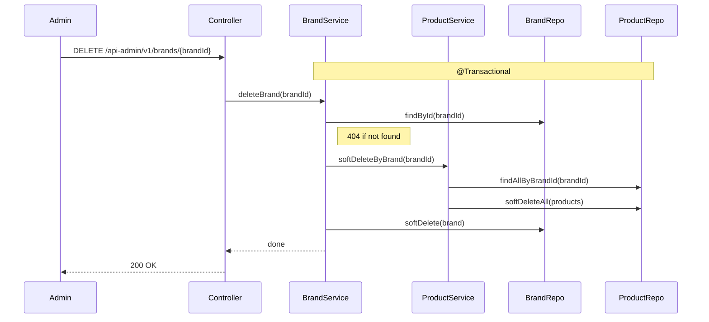
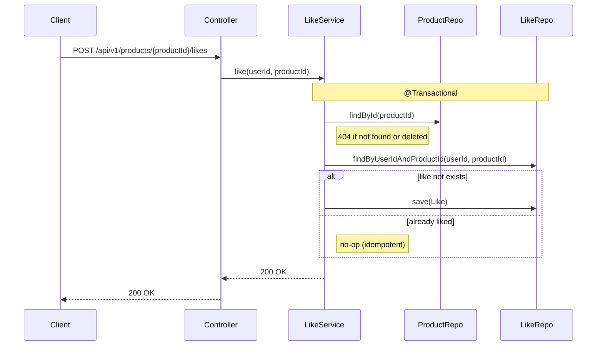
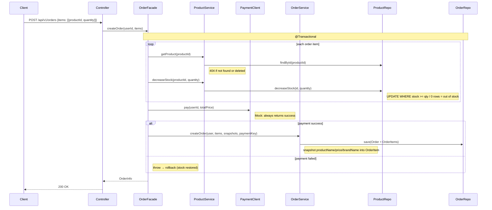

# 02. 시퀀스 다이어그램

## 다이어그램 선정 기준

당연한 CRUD 흐름은 굳이 안 그린다. 아래 기준에 해당하는 것만 그린다:
- 여러 도메인이 얽히는 흐름
- 트랜잭션 경계가 명확해야 하는 흐름
- 동료가 "여기서 이건 어떻게 돼?" 하고 물어볼 만한 흐름

---

## 1. 브랜드 삭제 → 상품도 같이 soft delete

### Why?
브랜드 지우면 소속 상품도 같이 soft delete 되는 흐름. 트랜잭션 경계랑 책임 위임이 맞는지 확인한다.

### 핵심 결정
- BrandService가 ProductService에 연쇄 삭제를 **위임** (하나의 @Transactional 안에서 원자적 처리)
- 삭제된 브랜드에 상품 등록 시도 시 404 거부
- **리스크**: BrandService -> ProductService 직접 의존 (나중에 도메인 이벤트로 분리 가능)

---

## 2. 좋아요 누르기

### Why?
POST /likes가 멱등하게 동작하는지, 삭제된 상품에 좋아요를 막는지 확인한다.

### 핵심 결정
- **멱등**: 이미 좋아요 눌린 상태면 200 OK, 아무 일도 안 일어남
- DB unique constraint `(user_id, product_id)` — 동시 요청 방어의 마지막 보루
- DuplicateKeyException 터지면 catch해서 200 반환 (동시 요청도 안전)
- likeCount: 지금은 COUNT 쿼리 (트래픽 늘면 반정규화로 전환)

---

## 3. 주문 생성 (재고 차감)

### Why?
가장 복잡한 흐름. Product + Order 도메인이 얽히고, 재고 차감이랑 스냅샷 저장이 한 트랜잭션 안에서 같이 일어난다.

### 핵심 결정
- **OrderFacade**가 ProductService + PaymentClient + OrderService를 조율 (Application 레이어의 책임)
- 재고: 조건부 UPDATE (`WHERE stock >= qty`) — 음수 재고 불가능
- 하나라도 실패하면 전체 주문 롤백
- **결제**: PaymentClient 인터페이스 → 지금은 MockPaymentClient (항상 성공). PG 모듈 들어오면 구현체만 교체.
- **결제 실패 시**: @Transactional 안에 있으니 롤백하면 재고도 자동 복구. 실 PG 연동하면 보상 트랜잭션으로 전환해야 함.
- **스냅샷**: productPrice, productName, brandName을 OrderItem에 복사
- **리스크**: 항목별 UPDATE loop (벌크 최적화는 나중에 필요 시 전환)

---

## 시나리오 검증 결과

### 시나리오 1: 두 유저가 동시에 마지막 1개 재고를 주문
- 조건부 UPDATE로 한 쪽만 성공, 다른 쪽은 재고 부족 에러 -> 전체 롤백
- **검증 완료**: 다이어그램의 `UPDATE WHERE stock >= qty` 흐름으로 커버됨

### 시나리오 2: 브랜드 삭제 직후 해당 브랜드 상품에 좋아요 요청
- 브랜드 삭제 -> 상품도 soft delete -> 좋아요 시 상품 조회에서 404
- **검증 완료**: LikeService의 `findById(productId)` 단계에서 삭제된 상품 차단

### 시나리오 3: 주문 완료 후 상품 가격 변경
- OrderItem에 주문 시점 가격이 스냅샷으로 남아있으니 영향 없음
- **검증 완료**: `snapshotFrom(product, brand)` 시점의 값이 그대로 남아있음

### 시나리오 4: 재고 차감 후 결제 실패
- 재고 차감 완료 → PaymentClient.pay() 실패 → 예외 발생
- @Transactional 롤백으로 재고 자동 복구
- **검증 완료**: 다이어그램의 `payment failed → rollback (stock restored)` 분기로 커버됨
- **주의**: 실 PG 연동 시에는 외부 호출이 트랜잭션 밖이므로 보상 트랜잭션 필요

### 시나리오 5: 유저가 좋아요 버튼을 빠르게 두 번 탭
- 첫 번째 요청: save 성공
- 두 번째 요청: 이미 존재 -> 아무것도 안 함 -> 200 OK
- 동시 도착 시: unique constraint가 DuplicateKeyException -> catch -> 200 OK
- **검증 완료**: 멱등 + 동시성 방어 모두 커버됨
