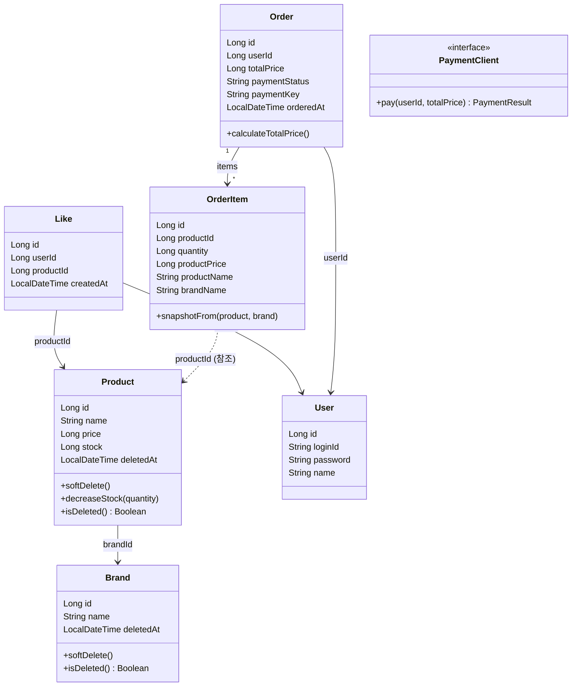

# 03. 클래스 다이어그램 (통합)

## Why?
도메인 객체들의 책임이 잘 나뉘어 있는지, 의존 방향이 맞는지 한눈에 확인한다.

---

## 다이어그램

---

## 의존 방향 정리

- **전부 단방향.** 양방향 의존 없음.
- `Product -> Brand` (종속 관계)
- `Like -> Product, User` (행동 기록)
- `Order -> User` (소유 관계)
- `OrderItem ..> Product` (ID 참조만, 실제 데이터는 스냅샷으로 복사)

---

## 책임 분배

| 객체 | 핵심 책임 | 비고 |
|------|-----------|------|
| Brand | 브랜드 정보 관리 + soft delete | |
| Product | 상품 정보 + 재고 관리 + soft delete | `decreaseStock()`에서 재고 체크 |
| Like | 유저-상품 간 좋아요 관계 | 상태 전이 없음 (있거나 없거나) |
| Order | 주문 건 관리 + 총액 계산 | `calculateTotalPrice()`는 OrderItem 합산 |
| OrderItem | 주문 시점 상품 정보를 스냅샷으로 들고 있음 | `snapshotFrom()`으로 원본에서 복사 |
| User | 유저 식별 정보 관리 | 인증 로직 없음 (헤더 식별) |
| PaymentClient | 외부 결제 시스템 연동 | 인터페이스. 지금은 MockPaymentClient (항상 성공) |

---

## 설계 의도

### BaseEntity 상속
Brand, Product, User는 `BaseEntity`를 상속받아 `id`, `createdAt`, `updatedAt`, `deletedAt`을 자동으로 갖는다. 다이어그램에서는 도메인 고유 필드만 표기했다.

### OrderItem의 스냅샷 전략
OrderItem이 Product를 직접 참조하지 않고, 주문 시점의 값을 복사하는 이유:
- 상품 가격이 변경돼도 기존 주문 이력에 영향 없음
- 상품이 삭제돼도 주문 이력은 그대로 남음
- 잘 변하는 것(가격, 이름)과 변하지 않는 것(주문 기록)을 분리

### PaymentClient 인터페이스
결제를 인터페이스로 추상화해둔 이유:
- 지금은 MockPaymentClient가 항상 성공을 반환
- PG 모듈이 들어오면 구현체만 교체하면 됨 (OrderFacade는 수정 불필요)
- domain 레이어에 인터페이스, infrastructure 레이어에 구현체 — 의존 역전

### Like의 단순함
Like는 상태 전이가 없다. 있거나 없거나 — 이 단순함이 멱등성 구현을 쉽게 만든다.
