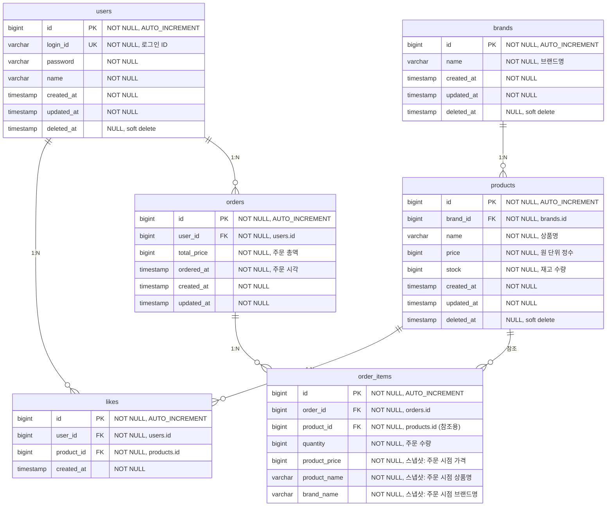

# 04. ERD (통합)

## Why?
전체 테이블 구조가 맞는지 확인한다 — FK, NOT NULL, 인덱스 후보, 스냅샷 필드, soft delete 전략.

---

## 다이어그램

---

## 테이블 설명

### users
유저 기본 정보. `login_id`는 unique로 중복 방지. 인증 로직은 없고 헤더로 식별만 한다.

### brands
브랜드 정보. soft delete 대상. 삭제 시 소속 products도 연쇄 soft delete.

### products
상품 정보. `brand_id`로 브랜드에 종속. `stock`은 재고 수량으로, 조건부 UPDATE로 동시성을 방어한다. `price`는 원 단위 정수 (소수점 없음).

### likes
유저-상품 간 좋아요 관계. `(user_id, product_id)` unique constraint로 멱등성 보장. soft delete 없음 — 좋아요 취소는 물리 삭제.

### orders
주문 건. `total_price`는 OrderItem 합산 값. `ordered_at`은 주문 시각 (created_at과 별도 관리). soft delete 없음 — 주문은 절대 안 지운다.

### order_items
주문 내 개별 항목. `product_id`는 원본 추적용 FK. 실제 데이터는 스냅샷 필드(`product_price`, `product_name`, `brand_name`)에 주문 시점 값을 복사해서 넣는다.

---

## 주요 제약조건

| 테이블 | 제약조건 | 이유 |
|--------|---------|------|
| likes | UNIQUE(user_id, product_id) | 멱등성 보장 + 동시성 방어 |
| products | stock >= 0 (조건부 UPDATE) | 음수 재고 방지 |
| users | UNIQUE(login_id) | 로그인 ID 중복 방지 |

---

## Soft Delete 전략

| 대상 | soft delete | 이유 |
|------|-------------|------|
| users | O (deleted_at) | 탈퇴해도 이력은 남겨야 함 |
| brands | O (deleted_at) | 지워도 기존 주문 이력에서 참조됨 |
| products | O (deleted_at) | 지워도 기존 주문/좋아요 이력에서 참조됨 |
| likes | X (물리 삭제) | 있거나 없거나. 이력 남길 필요 없음 |
| orders | X (삭제 없음) | 주문은 절대 안 지움 |
| order_items | X (삭제 없음) | 주문이랑 같이 영구 보관 |

---

## 인덱스 후보

| 테이블 | 컬럼 | 이유 |
|--------|------|------|
| products | brand_id | 브랜드별 상품 필터링 |
| products | created_at | latest 정렬 |
| likes | (user_id, product_id) | unique constraint + 조회 성능 |
| likes | product_id | 상품별 좋아요 COUNT |
| orders | (user_id, ordered_at) | 유저별 기간 필터 조회 |
| order_items | order_id | 주문별 항목 조회 |

---

## 리스크 및 확장 포인트

| 리스크 | 현재 선택 | 확장 방향 |
|--------|-----------|-----------|
| likeCount 조회 성능 | 매번 COUNT 쿼리 | Product.likeCount 반정규화 |
| 주문 항목별 UPDATE loop | 단건씩 처리 | 벌크 UPDATE 전환 |
| 브랜드 삭제 연쇄 의존 | BrandService -> ProductService 직접 호출 | 도메인 이벤트로 분리 |
| 결제 연동 시 재고 복구 | 미구현 (결제 없음) | 보상 트랜잭션 / Saga 패턴 |
| 삭제된 상품의 좋아요 조회 | soft delete된 상품도 좋아요 유지 | "삭제된 상품입니다" 표시 처리 |
